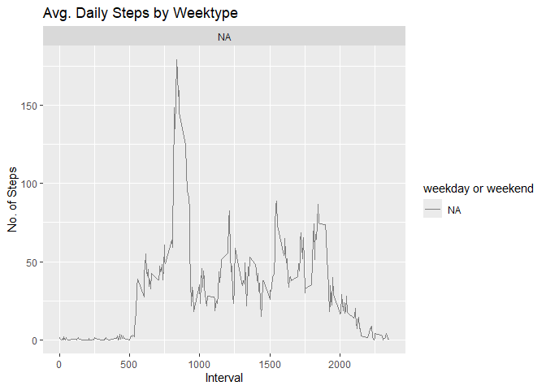

## Loading and preprocessing the data


``` r
library("data.table")
library(ggplot2)

unzip("activity.zip", exdir = "data")
activityDT <- fread(input = "data/activity.csv")
```

## What is mean total number of steps taken per day?


``` r
Total_Steps <- activityDT[, c(lapply(.SD, sum, na.rm = FALSE)), .SDcols = c("steps"), by = .(date)] 

head(Total_Steps, 10)
```

```
##           date steps
##         <IDat> <int>
##  1: 2012-10-01    NA
##  2: 2012-10-02   126
##  3: 2012-10-03 11352
##  4: 2012-10-04 12116
##  5: 2012-10-05 13294
##  6: 2012-10-06 15420
##  7: 2012-10-07 11015
##  8: 2012-10-08    NA
##  9: 2012-10-09 12811
## 10: 2012-10-10  9900
```


``` r
ggplot(Total_Steps, aes(x = steps)) +
    geom_histogram(fill = "blue", binwidth = 1000) +
    labs(title = "Daily Steps", x = "Steps", y = "Frequency")
```

```
## Warning: Removed 8 rows containing non-finite outside the scale range
## (`stat_bin()`).
```

<!-- -->


``` r
Total_Steps[, .(Mean_Steps = mean(steps, na.rm = TRUE), Median_Steps = median(steps, na.rm = TRUE))]
```

```
##    Mean_Steps Median_Steps
##         <num>        <int>
## 1:   10766.19        10765
```

## What is the average daily activity pattern?


``` r
IntervalDT <- activityDT[, c(lapply(.SD, mean, na.rm = TRUE)), .SDcols = c("steps"), by = .(interval)] 

ggplot(IntervalDT, aes(x = interval , y = steps)) + geom_line(color="blue", size=1) + labs(title = "Avg. Daily Steps", x = "Interval", y = "Avg. Steps per day")
```

```
## Warning: Using `size` aesthetic for lines was deprecated in ggplot2 3.4.0.
## ℹ Please use `linewidth` instead.
## This warning is displayed once every 8 hours.
## Call `lifecycle::last_lifecycle_warnings()` to see where this warning was
## generated.
```

<!-- -->


``` r
IntervalDT[steps == max(steps), .(max_interval = interval)]
```

```
##    max_interval
##           <int>
## 1:          835
```

## Imputing missing values


``` r
activityDT[is.na(steps), .N ]
```

```
## [1] 2304
```

``` r
# alternative solution
nrow(activityDT[is.na(steps),])
```

```
## [1] 2304
```

``` r
# Filling in missing values with median of dataset. 
activityDT[is.na(steps), "steps"] <- activityDT[, c(lapply(.SD, median, na.rm = TRUE)), .SDcols = c("steps")]
```


``` r
data.table::fwrite(x = activityDT, file = "data/tidyData.csv", quote = FALSE)
```


``` r
# total number of steps taken per day
Total_Steps <- activityDT[, c(lapply(.SD, sum)), .SDcols = c("steps"), by = .(date)] 

# mean and median total number of steps taken per day
Total_Steps[, .(Mean_Steps = mean(steps), Median_Steps = median(steps))]
```

```
##    Mean_Steps Median_Steps
##         <num>        <int>
## 1:    9354.23        10395
```

``` r
ggplot(Total_Steps, aes(x = steps)) + geom_histogram(fill = "blue", binwidth = 1000) + labs(title = "Daily Steps", x = "Steps", y = "Frequency")
```

<!-- -->
Type of Estimate | Mean_Steps | Median_Steps
--- | --- | ---
First Part (with na) | 10765 | 10765
Second Part (fillin in na with median) | 9354.23 | 10395

## Are there differences in activity patterns between weekdays and weekends?

1. Create a new factor variable in the dataset with two levels – “weekday” and “weekend” indicating whether a given date is a weekday or weekend day.


``` r
# Just recreating activityDT from scratch then making the new factor variable. (No need to, just want to be clear on what the entire process is.) 
activityDT <- data.table::fread(input = "data/activity.csv")
activityDT[, date := as.POSIXct(date, format = "%Y-%m-%d")]
activityDT[, `Day of Week`:= weekdays(x = date)]
activityDT[grepl(pattern = "Monday|Tuesday|Wednesday|Thursday|Friday", x = `Day of Week`), "weekday or weekend"] <- "weekday"
activityDT[grepl(pattern = "Saturday|Sunday", x = `Day of Week`), "weekday or weekend"] <- "weekend"
activityDT[, `weekday or weekend` := as.factor(`weekday or weekend`)]
head(activityDT, 10)
```

```
##     steps       date interval Day of Week weekday or weekend
##     <int>     <POSc>    <int>      <char>             <fctr>
##  1:    NA 2012-10-01        0 понедельник               <NA>
##  2:    NA 2012-10-01        5 понедельник               <NA>
##  3:    NA 2012-10-01       10 понедельник               <NA>
##  4:    NA 2012-10-01       15 понедельник               <NA>
##  5:    NA 2012-10-01       20 понедельник               <NA>
##  6:    NA 2012-10-01       25 понедельник               <NA>
##  7:    NA 2012-10-01       30 понедельник               <NA>
##  8:    NA 2012-10-01       35 понедельник               <NA>
##  9:    NA 2012-10-01       40 понедельник               <NA>
## 10:    NA 2012-10-01       45 понедельник               <NA>
```

2. Make a panel plot containing a time series plot (i.e. 𝚝𝚢𝚙𝚎 = "𝚕") of the 5-minute interval (x-axis) and the average number of steps taken, averaged across all weekday days or weekend days (y-axis). See the README file in the GitHub repository to see an example of what this plot should look like using simulated data.


``` r
activityDT[is.na(steps), "steps"] <- activityDT[, c(lapply(.SD, median, na.rm = TRUE)), .SDcols = c("steps")]
IntervalDT <- activityDT[, c(lapply(.SD, mean, na.rm = TRUE)), .SDcols = c("steps"), by = .(interval, `weekday or weekend`)] 

ggplot(IntervalDT , aes(x = interval , y = steps, color=`weekday or weekend`)) + geom_line() + labs(title = "Avg. Daily Steps by Weektype", x = "Interval", y = "No. of Steps") + facet_wrap(~`weekday or weekend` , ncol = 1, nrow=2)
```

<!-- -->
